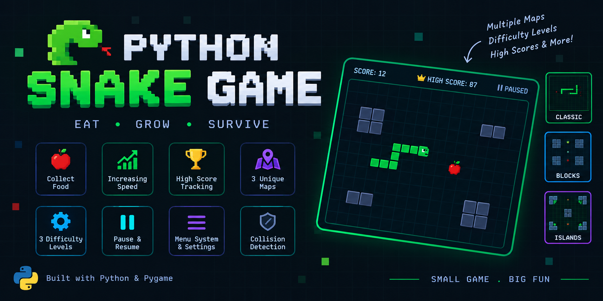

# Python Snake Game

<p align="center">
  <a href="https://github.com/yourusername/python-snake-game">
    
  </a>
</p>

<p align="center">
  <b>A classic, fast-paced Snake arcade game built using Python and Pygame.</b>
</p>

---

## 🚀 Features

- **🎮 Responsive Controls:** Full support for `WASD` and `Arrow Keys`.
- **📈 Dynamic Speed Adjustment:** Snake speed accelerates as your score rises.
- **🏆 Live Score Tracker:** Real-time HUD showing your current score.
- **💡 Beginner-Friendly Code:** Clean, modular structure for easy customization and learning.

---

## 🛠️ Requirements & Installation

- **Python:** 3.8 or higher
- **Pygame:** Latest version

Install the required dependency with:

```bash
pip install pygame
```

Clone the repository and run `main.py`:

```bash
git clone https://github.com/DevWithSiddharth/Python-Snake-Game.git
cd python-snake-game
python main.py
```

---


## 🎮 How to Play

### 🎯 Objective

Eat the 🍎 apples to increase your score and grow the snake.

Avoid:

- 🧱 Map obstacles
- 🐍 Your own body

The game ends when the snake collides with an obstacle or itself.

---

## ⚡ Difficulty

| Difficulty | Starting Speed |
| ---------- | -------------- |
| 🟢 Easy    | 7 moves/sec    |
| 🟡 Normal  | 10 moves/sec   |
| 🔴 Hard    | 15 moves/sec   |

The snake gets faster every **5 points**, up to a maximum of **25 moves/sec**.

---

## 🗺️ Maps

| Map | Description |
| --- | ----------- |
| 🌿 Classic | No obstacles |
| 🧱 Blocks | Four obstacle blocks |
| 🏝️ Islands | Four islands with a center obstacle |

---

## 🕹 Controls

### 🎮 Movement

- ⬆️ **Up Arrow / W** → Move Up
- ⬇️ **Down Arrow / S** → Move Down
- ⬅️ **Left Arrow / A** → Move Left
- ➡️ **Right Arrow / D** → Move Right

### ⏸️ Game Controls

- **P** → Pause / Resume
- **M** → Return to Main Menu
- **ESC** → Quit

### 💀 Game Over

- **R** → Restart
- **M** → Main Menu
- **ESC** → Quit

### 📋 Menus

- **↑ / ↓** → Select option
- **ENTER** → Confirm
- **ESC** → Go back

---

## 🏆 High Score

Your best score is automatically saved in:

```text
highscore.txt
```

---

## 📄 License

Distributed under the [MIT License](LICENSE).


<p align="center"> <b>Made with ❤️ using Pygame</b><br> <i>Eat. Grow. Survive.</i> </p>